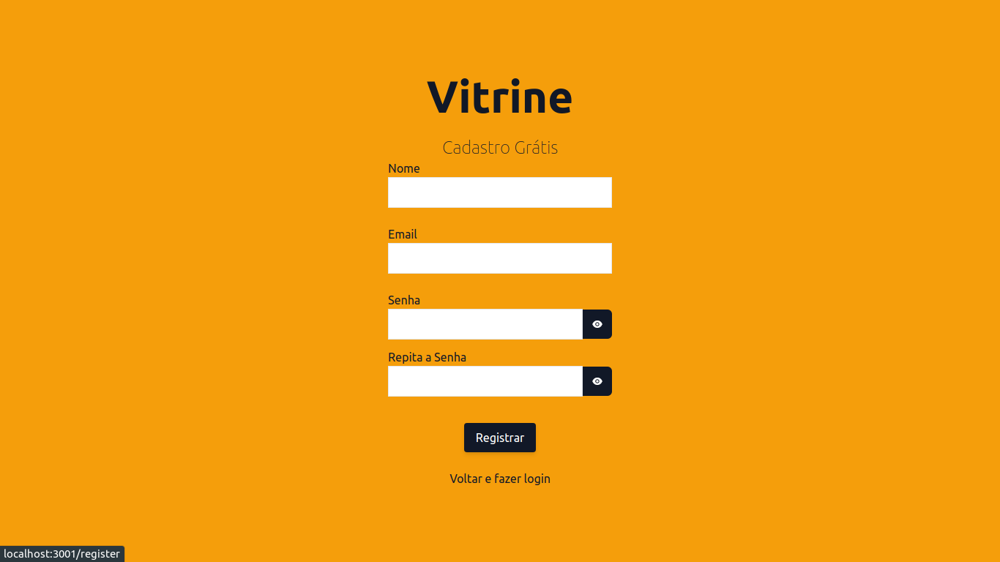
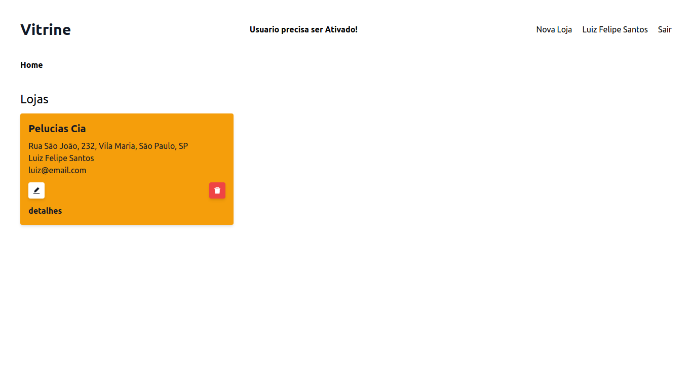
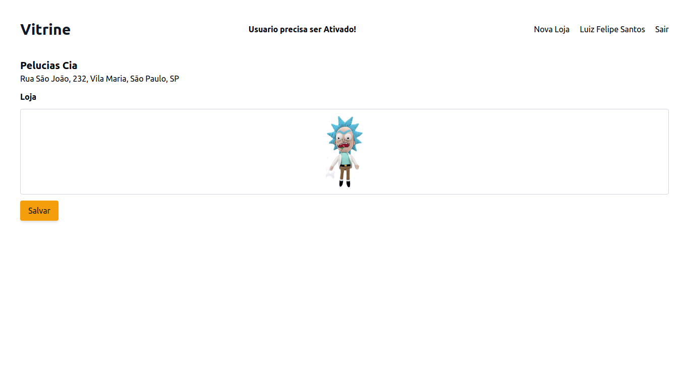
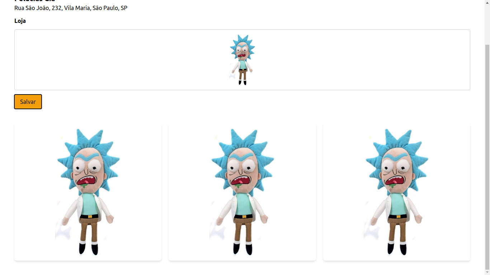

# vitrine

## Sobre

Vitrine é um app criado com fins educativos, onde o dono de um estabelecimento comercial pode inserir e apresentar informações de sua loja, como o endereço, o nome da loja e imagens.
#


#

## Tabela de conteúdos

<!--ts-->
   * [Sobre](#Sobre)
   * [Tabela de Conteudo](#tabela-de-conteúdos)
   * [Como usar](#como-usar?)
      * [Com Docker](#com-docker)
      * [Sem Docker](#sem-docker)
   * [Demonstração](#demonstração)
   * [Técnologias](#técnologias)
<!--te-->

## Como usar?
#
### Com docker
```sh
git clone --recursive git@github.com:luizphelipe800/vitrine-workspace.git
```
```sh
cd ./vitrine-workspace
```
```sh
docker-compose up -d
```
```sh
cd ./api
```
```sh
docker exec -it id-api-container yarn sequelize db:migrate
```
no navegador acessar http://localhost/

#
### Sem docker

``` sh
git clone --recursive git@github.com:luizphelipe800/vitrine-workspace.git
```
```sh
cd ./vitrine-workspace
```
```sh
cd ./api
```
```sh
yarn sequelize db:migrate
ou
npx sequelize db:migrate
```
```sh
yarn start
```
```sh
cd ../webapp
```
```sh
yarn start
```
no navegador acessar http://localhost:3001/

## Demonstração


Página de login


Página de cadastro


Página principal


Página de detalhes da loja


Galeria de imagens

## Técnologias

### webapp
* [ReactJS](https://github.com/facebook/react)
* [React Router Dom](https://github.com/ReactTraining/react-router)
* [TailwindCSS](https://github.com/tailwindlabs/tailwindcss)

### api
* [Express](https://github.com/expressjs/express)
* [PassportJS](https://github.com/jaredhanson/passport)
* [Multer](https://github.com/expressjs/multer)
* [Sequelize](https://github.com/sequelize/sequelize)

